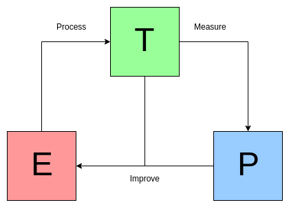

# Introduction to Machine Learning

## What is Machine Learning?

- Machine learning is not something like a futuristic fantasy. Many people when hearing machine learning, they often pictures a robot, but it's not, it's already here. For example, that is *spam filters* that can learn to flag spam given examples of spam emails.
- To answer for the question what is we can simply understand that → Machine learning is just a program that can **learn from data**
- From the science view point:
  - A computer program is said to learn from experience E with respect to some task T and some performance measure P, if its performance on T, as measured by P, improves with experience E. ( Tom Mitchell

    

## Why we use Machine Learning?

- To make your life easier 😇. 

- Imagine that you have 1 millions of emails and your task is to classify what is spam and not spam email. Can you measures how much of your time spend on this task compare to computers. Its cost you much effort than computers that you can not imagine 🙂

## Types of Machine Learning:

#### Supervised/Unsupervised Learning:

    
 <b> Supervised Learning: </b> 

- The training data you feed to the algorithms that have *labels.* **The computer try to learn with a teacher**
- For example, the spam filters model is trained with many emails along with their *labels* ( spam or not spam ) and after learn from training data, the model can predict new emails that is spam or not.
- Some popular supervised learning algorithm:
    1. Linear Regression
    2. Logistic Regression
    3. K-Nearest Neighbors
    4. Support Vector Machines (SVMs)
    5. Decision Trees and Random Forests
    6. Neural networks

    
 <b> Unsupervised Learning: </b> 

- As you can guess from the name, that unsupervised learning given the training data is unlabeled. **The computer try to learn without a teacher.**
- For example, you want to detect group of similar visitors ( what group a visitors belong to ). When visitors come to your webpage, the computer will clustering them into several group for demands and use this data to recommends the visitors something that they **might need.**
- There are many application of unsupervised learning such as *visualization algorithms, dimensionality reduction, anomaly detection, association rule learning...* I will go through of this later. You can search key word of these term on the Internet to understand the idea of each.
- Some popular algorithm:
    - Clustering
        - K-Means
        - DBSCAN
        - Hierarchical Cluster Analysis (HCA)
        - Anomaly detection and novelty detection
        - One-class SVM
        - Isolation Forest
    - Visualization and dimensionality reduction
        - Principal Component Analysis (PCA)
        - Kernel PCA
        - Locally-Linear Embedding (LLE)
        - t-distributed Stochastic Neighbor Embedding (t-SNE)
    - Association rule learning
        - Apriori
        - Eclat

    
 <b> Semi-supervised Learning: </b> 

- This algorithm can deal with *labeled and unlabeled training data.* **The teacher can help a half and the other half you must learn by yourself**
- For example, Google Photos automatically recognize the same person A shows up in the photo 1,5,11. While another person B is shows up in photos 2,5,7. This is unsupervised part. But the algorithm needs you to tell it who these people are so you need to name everyone in the photo ( this is as label data ). And after that you can search the name of person and algorithm will return you photos that this person shows up. This is supervised part.
- Some popular algorithms:
    - Deep belief networks ( DBNs)
    - Restricted Boltzmann machines ( RBMs )

    
 <b> Reinforcement Learning: </b> 

- *This is a very different beast*
- The learning system (*agent*) observe the environment, select and perform actions, and get *rewards ( or penalties ).* The task is that it must learn by itself what is the best strategy, called *policy* to get the most reward over time.
- For example [DeepMind's AlphaGo](https://www.youtube.com/watch?v=WXuK6gekU1Y)

#### Batch and Online Learning

    
 <b> Batch Learning ( Offline learning ): </b> 

    
- In this the system can not learn incrementally, it must be trained with all the available data.
- First it will be trained with all available data and then it is deploy into production and runs without learning anymore ( this is call *offline learning* ). When you want the system know about the new data, there is only way that you must trained the system from the beginning with all data include old data and new data. After you have the new model then stop the old system and replace it with the new one.
- This solution is very simple and also works fine, but training again the whole dataset that costs a lot of computing resources.

    
 <b> Online Learning: </b> 

- For solving the problem from the offline learning we have the new one, *online learning.* In this, you train the system incrementally by feeding it data instances sequentially (individuals or small groups call *mini-batches*). Each step of learning is very fast and cheap, so the system can learn about new data on the fly.
- This is great for adapting to change rapidly or autonomously and also your limited computing resources. For a huge dataset, the algorithms loads part of the data, training in this part and repeat until run all of the dataset.

## Two main approaches to generalization:

    
 <b> Instance-based Learning: </b> 

- This is simply learn by heart ( the most trivial way 👎 ). The system learns the examples by heart, then generalizes to new cases by comparing them to the learned examples, using *similarity measure*
- For example, the spam filter in this way would cluster all the emails that are identical or very similar to emails that have already been labeled by user. That will count the number of words they have in common and flag as spam if it has many words in common with spam emails

    
 <b> Model-based Learning: </b> 

- From the assumption about the given data are made explicit in the form of a model. We imagine or generalize from a set of data to build a model from given dataset, then use that model to make predictions. This is called model-based learning
- For example, the data is given and from this we use any tools to plot the graph and recognize that seem to be a trend in the graph. Although the data is *noisy,* it still look like linearly. So you decide to select *linear model* to make a prediction this step is called *model selection*.

## Challenging in Machine Learning

 <b> Insufficient Quantity of Training Data </b> 

- For most Machine Learning algorithms that take a lot of data to work properly.
- For example, the children is able to recognize the apple after 4 or 5 images but the system may need a thousands or even millions of images to be able to recognize the apple

 <b> Poor Quantity Data </b> 

- If your training data is full of errors, outliers and noise, it will make harder for the system to perform well.
- There is a reason why most data scientist spend most of their time just cleaning up the training data.

 <b> Irrelevant Features </b> 

- I think you have been heard about **garbage in, garbage out**. If the training contains too many irrelevant features, the system will be incapable of giving accurate answer.
- We come up with the process, called *feature engineering*, includes:
  - *Feature selection:* selecting the most useful feature to train on among existing features.
  - *Feature extraction:* combining existing features to produce a more useful ones.

 <b> Overfitting the Training Data</b> 

- Its means that the model performs well on the training data, but it does bad on the testing set.

 <b> Underfitting the Training Data </b> 

- *Underfitting* is the opposite of overfitting. It occurs when your model is too simple to learn the structure of data. Therefore, its prediction are bound to be inaccurate, even on the training set.

## Testing and Validating
- The only way to know how performance of the model is to try it out on new case. Then we will split data into two sets: *training set* and *test set*.
- Simply by the name, you train your model using training set and test it on the test set. By estimating the error you can know how well the model performance. The error on the new case we call it *generalization error*.
- If the training error is low, but the generalization error is high, it means that your model is overfitting on the training set.

<b> Hyperparameter Tuning and Model Selection </b>
- How can you decide to choose between 2 models? -> train both and compare how well they are on
- After compare 2 model, suppose linear model is better and you want to apply some regularization to avoid overfitting. How do you choose the regularization hyperparameter? -> Suppose you have 5 different parameter then you train 5 different model. After that you have the best parameter with the lowest generalization error (assume 5%).
- You launch it to production but the problem occurs. In the new dataset its produce 15% error. So the problem in here that you just adapted and adjust parameter the model to produce the best model for *particular set* not perform well on new data.
- **The solution** is we have another set call *validation set* that is separated from the training set. You train multiple model with specific hyperparameter on the reduce training set (full training set - validation set) and select the model perform best on validation test. After this you train this best model on the full training set (include validation), this give you the final model. You evaluate the final model on test set to see the generalization error.
- However, if validation set is too small, then the model will be imprecise and if the validation set is too large then the remaining training is small. The solution is perform *cross-validation*, using many small validation sets. Each model is evaluated once per validation test, and calculate average all the evaluation of a model, we will get much more accurate performance.

